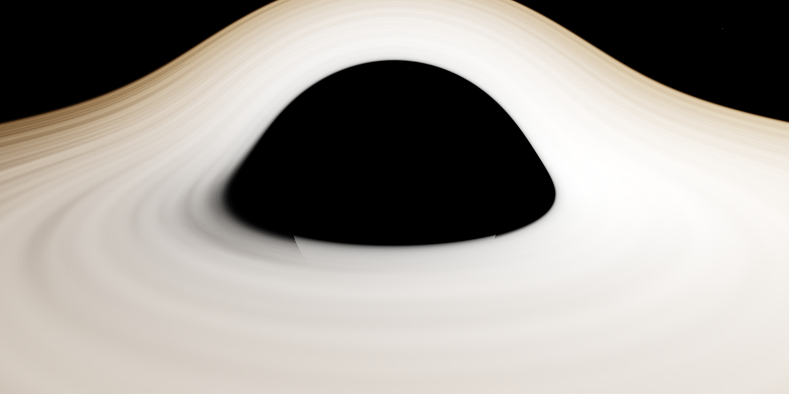
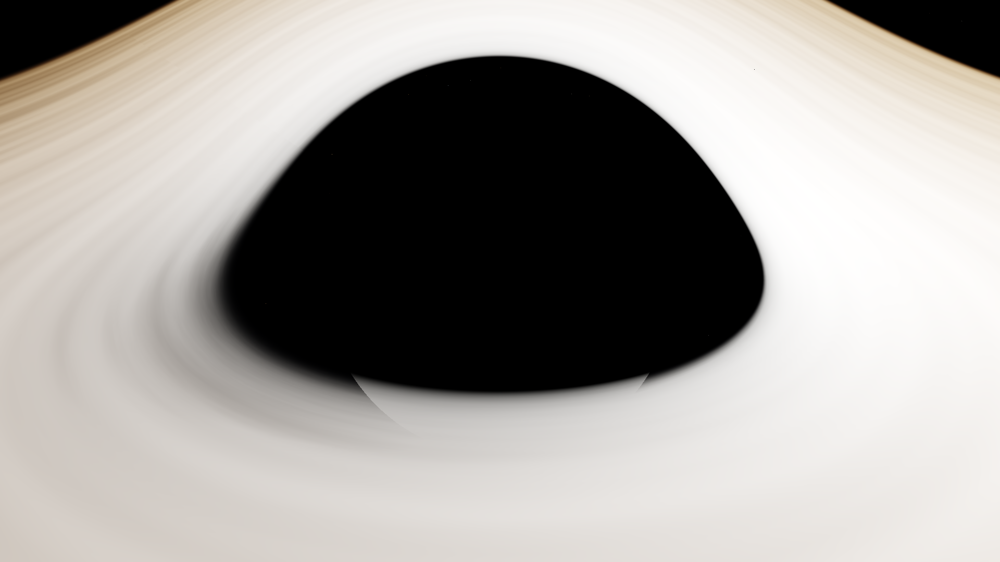
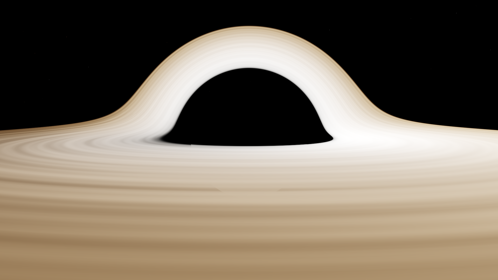
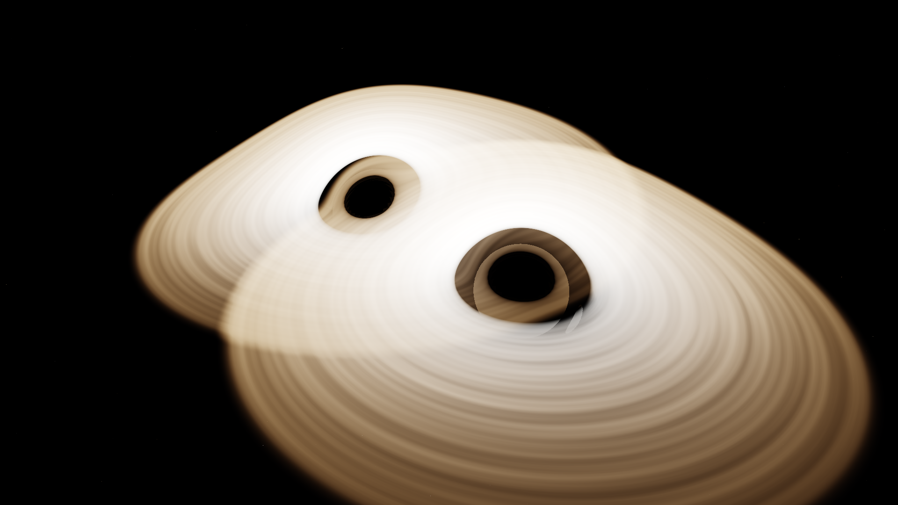
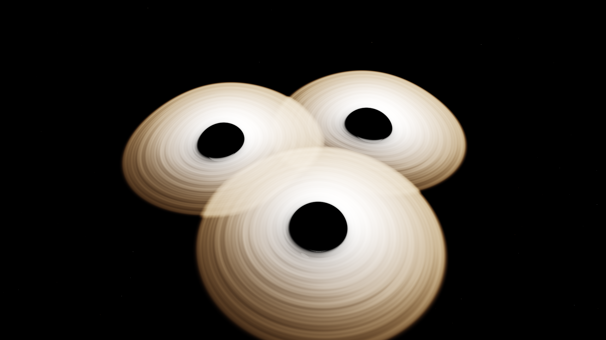

# spacetime-playground

Real-time interactive Schwarzschild black hole ray marcher with gravitational lensing, built with Rust + wgpu.



## Gallery

| Single Black Hole | Gravitational Lensing |
|---|---|
|  |  |

| Binary System | Triple System |
|---|---|
|  |  |

| Edge-on Accretion Disk |
|---|
|  |

## Prerequisites

- [Rust](https://rustup.rs/) (stable toolchain)
- A GPU with Metal (macOS), Vulkan, or DX12 support

## Running

```bash
cargo run
```

For an optimized build (much faster rendering):

```bash
cargo run --release
```

## Controls

| Input | Action |
|---|---|
| Left mouse drag | Orbit camera around black hole |
| Scroll wheel | Zoom in/out |
| WASD | Pan camera target |
| Tab | Toggle UI panel |
| F12 | Save screenshot |

## UI Parameters

The egui panel (toggle with Tab) exposes:

- **Preset** — Single, Binary, or Triple black hole configurations
- **Simulation** — Pause/resume and speed control for N-body dynamics
- **Schwarzschild radius** — Size of each black hole's event horizon
- **Accretion disk** — Inner/outer radius multipliers
- **Camera distance** — Orbital radius
- **FOV** — Field of view in radians
- **Max RK4 steps** — Geodesic integration precision
- **Step size (dphi)** — Integration step size
- **Background** — Checkerboard or star field
- **Screenshot** — Capture the current render to `screenshots/`

## CLI Screenshots

Render headless screenshots without opening a window:

```bash
cargo run --release -- --screenshot [OPTIONS]
```

### Options

| Flag | Default | Description |
|---|---|---|
| `--preset <name>` | `single` | Simulation preset: `single`, `binary`, `triple` |
| `--width <px>` | `1920` | Output width in pixels |
| `--height <px>` | `1080` | Output height in pixels |
| `--camera-distance <f>` | `10.0` | Camera orbital distance |
| `--camera-azimuth <f>` | `0.5` | Camera azimuthal angle (radians) |
| `--camera-elevation <f>` | `1.2` | Camera polar angle (radians) |
| `--camera-fov <f>` | `1.0` | Field of view (radians) |
| `--max-steps <n>` | `600` | RK4 integration steps |
| `--step-size <f>` | `0.1` | Integration step size |
| `--background <mode>` | `stars` | `checker` or `stars` |
| `--sim-time <f>` | `0.0` | Advance simulation time (seconds, for multi-body) |
| `--output <path>` | `screenshot.png` | Output file path |

### Examples

```bash
# Classic single black hole hero shot
cargo run --release -- --screenshot --camera-distance 8 --max-steps 1000

# Binary black holes after 2 seconds of orbital dynamics
cargo run --release -- --screenshot --preset binary --sim-time 2.0 --camera-distance 15

# Edge-on accretion disk view
cargo run --release -- --screenshot --camera-distance 6 --camera-elevation 1.55 --camera-fov 1.2

# 4K render
cargo run --release -- --screenshot --width 3840 --height 2160 --max-steps 1500 --output hero_4k.png
```
